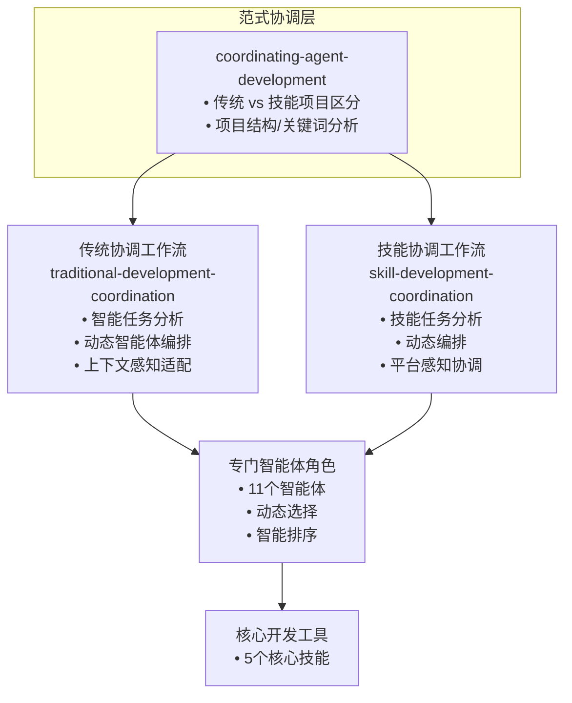

# AgentDev Suite

🌐 语言切换: [English](docs/en/README.md) | **中文**

📚 文档导航:
- [用户使用指南](docs/zh/usage-guide.md) - 如何进行功能认领、开发、提交
- [智能体产物目录结构](docs/zh/agent-artifacts.md) - 各智能体生成产物的组织结构

一个全面的多平台智能体开发套件，支持 Claude Code、OpenCode 和 Codex，提供覆盖完整软件开发生命周期的智能体协作能力。

## 概述

**AgentDev Suite** 是一个革命性的智能体驱动开发框架，通过专门的AI智能体实现结构化软件开发。它采用独特的双范式协调系统，根据项目上下文自动路由开发任务到相应的工作流：

- **传统软件开发**：可执行代码、API、服务、库
- **技能项目开发**：AI技能、指导包、插件项目

### 核心创新

- **范式路由**：自动检测项目类型并路由到专门的协调系统
- **多平台支持**：为 Claude Code、OpenCode 和 Codex 提供统一的技能库
- **渐进式披露**：通过三级加载系统实现高效的上下文管理
- **智能体角色专业化**：11个专门角色覆盖不同开发阶段
- **结构化协作**：基于目录的工作空间支持多智能体协调

## 安装

**注意：** 安装方法因平台和用户类型（AI助手 vs 人类用户）而异。

### 对于AI助手

AI助手可以直接获取安装说明：

#### Codex
告诉 Codex：
```
Fetch and follow instructions from https://raw.githubusercontent.com/gongxh13/agentdev-suite/refs/heads/main/.codex/INSTALL.md
```

#### OpenCode
告诉 OpenCode：
```
Fetch and follow instructions from https://raw.githubusercontent.com/gongxh13/agentdev-suite/refs/heads/main/.opencode/INSTALL.md
```

#### Claude Code
告诉 Claude Code：
```
Fetch and follow instructions from https://raw.githubusercontent.com/gongxh13/agentdev-suite/refs/heads/main/.claude-plugin/INSTALL.md
```

### 对于人类用户

#### 远程安装（从Git仓库）
目前只有 Claude Code 支持从Git仓库远程安装：

##### Claude Code

**命令行：**
```bash
# 添加Git仓库作为市场
claude plugin marketplace add https://github.com/gongxh13/agentdev-suite.git
# 从添加的市场安装插件
claude plugin install agentdev-suite
```

**在 Claude Code 中（斜杠命令）：**
首先，从Git仓库注册市场：
```
/plugin marketplace add https://github.com/gongxh13/agentdev-suite.git
```

然后从此市场安装插件。使用 `/plugin marketplace list` 检查市场名称：
```
/plugin install agentdev-suite@agentdev-suite-dev
```

*示例（如果市场名为"agentdev-suite-dev"）：*
```
/plugin install agentdev-suite@agentdev-suite-dev
```

#### 源代码安装
从本地源代码安装：

##### Claude Code

**命令行：**
```bash
# 添加本地目录作为市场
claude plugin marketplace add ./
# 从本地市场安装插件
claude plugin install agentdev-suite
```

**在 Claude Code 中（斜杠命令）：**
首先，将本地目录注册为市场（带名称）：
```
/plugin marketplace add ./ --name agentdev-suite-dev
```

然后从此市场安装插件：
```
/plugin install agentdev-suite@agentdev-suite-dev
```

*如果不指定名称，请使用 `/plugin marketplace list` 检查市场名称，并使用 `@<marketplace-name>` 后缀。*

##### Codex
```bash
cp -r . ~/.codex/agentdev-suite
# 更新 ~/.codex/AGENTS.md 添加：
# ## agentdev-suite
# <EXTREMELY_IMPORTANT>
# You have access to agentdev-suite. RIGHT NOW run: ~/.codex/agentdev-suite/.codex/agentdev-suite-codex bootstrap
# </EXTREMELY_IMPORTANT>
```

##### OpenCode
```bash
git clone https://github.com/gongxh13/agentdev-suite.git ~/.config/opencode/agentdev-suite
mkdir -p ~/.config/opencode/plugins
ln -s ~/.config/opencode/agentdev-suite/.opencode/plugins/agentdev-suite.js ~/.config/opencode/plugins/agentdev-suite.js
mkdir -p ~/.config/opencode/skills
ln -s ~/.config/opencode/agentdev-suite/skills ~/.config/opencode/skills/agentdev-suite
```

## 架构设计

AgentDev Suite 遵循**增强的三层协调架构**，具备智能任务分析和动态智能体编排能力：



### 智能体详细列表

| 分类 | 智能体名称 | 角色缩写 | 主要职责 |
|------|------------|----------|----------|
| **传统开发智能体** | `traditional-pm` | pm | 产品策略和高级需求分析 |
| | `traditional-po` | po | 产品待办事项管理和用户故事分解 |
| | `traditional-arch` | arch | 系统架构和技术设计 |
| | `traditional-dev` | dev | 代码实现和单元测试 |
| | `traditional-qa` | qa | 质量验证和错误报告 |
| | `traditional-ops` | ops | 构建系统、部署流水线和基础设施配置 |
| **技能开发智能体** | `skill-ra` | analyst | 技能生态系统策略和需求分析 |
| | `skill-arch` | arch | 技能架构和多平台配置设计 |
| | `skill-dev` | dev | 技能项目实现和平台配置 |
| | `skill-qa` | qa | 技能结构验证和平台兼容性测试 |
| | `skill-platform` | platform | 多平台技能分发和部署配置 |

### 核心开发工具

| 工具名称 | 主要功能 |
|----------|----------|
| `skill-creator` | 遵循Claude最佳实践的引导式技能创建 |
| `skill-project-scaffolder` | 多平台项目结构生成 |
| `skill-development-methodology` | 技能设计原则和模式 |
| `traditional-development-methodology` | 传统开发最佳实践 |
| `managing-git-workflows` | 带有语义提交指南的版本控制 |

### 1. 范式协调层

**`coordinating-agent-development`** - 智能第一级路由器，执行范式区分：
- **项目结构指示器**：`src/`、`tests/`、`package.json`（传统） vs `skills/`、`.claude-plugin/`、SKILL.md 文件（技能）
- **请求关键词**："build an app"、"create API"（传统） vs "create skill"、"skill project"（技能）
- **决策规则**：明确指示器 → 对应协调；混合 → 分析主要重点；无指示器 → 询问用户
- **架构角色**：提供高效的第一级路由，将详细任务分析委托给专门的协调层

### 2. 具备智能编排的专门协调工作流

#### 传统软件开发 (`traditional-development-coordination`)
**增强的智能任务分析和动态智能体编排**：
- **任务类型检测**：分析请求以识别特定任务类型（完整项目、架构设计、需求分析、代码实现、测试验证、维护任务、文档任务）
- **动态智能体选择**：根据任务类型选择最优智能体序列
- **智能工作流适配**：在完整6阶段工作流和针对性智能体组合之间选择
- **上下文感知执行**：根据项目成熟度和现有结构调整工作流强度

**工作流模式**：
- **完整项目**：包含所有智能体的完整6阶段工作流
- **架构重点**：架构师 →（开发者用于原型设计）
- **需求重点**：产品经理 → 产品负责人
- **实现重点**：开发者 → 测试者
- **测试重点**：测试者 →（开发者用于修复）
- **维护任务**：具备上下文分析的自适应工作流
- **文档任务**：针对性文档工作流

#### 技能项目开发 (`skill-development-coordination`)
**增强的智能技能任务分析和动态编排**：
- **技能任务类型检测**：识别技能特定任务类型（完整技能项目、技能架构、需求分析、单个技能创建、测试验证、维护任务、平台配置）
- **动态智能体/技能选择**：根据任务类型选择最优智能体/技能序列
- **平台感知协调**：智能处理多平台配置
- **渐进式披露优化**：确保技能项目的高效上下文管理

**工作流模式**：
- **完整技能项目**：包含所有智能体的完整6阶段工作流
- **架构重点**：技能架构师 → 技能项目脚手架
- **需求重点**：技能需求分析师
- **技能创建重点**：技能创建者 → 技能测试者
- **测试重点**：技能测试者 →（技能创建者用于修复）
- **维护任务**：技能更新的自适应工作流
- **平台配置**：脚手架 → 架构师用于多平台设置

### 3. 具备动态编排的专门智能体角色

#### 传统开发智能体（动态选择）
- **`traditional-pm`**：产品策略和高级需求分析
- **`traditional-po`**：产品待办事项管理和用户故事分解
- **`traditional-arch`**：系统架构和技术设计
- **`traditional-dev`**：代码实现和单元测试
- **`traditional-qa`**：质量验证和错误报告
- **`traditional-ops`**：构建系统、部署流水线和基础设施配置

#### 技能开发智能体（动态选择）
- **`skill-ra`**：技能生态系统策略和需求分析
- **`skill-arch`**：技能架构和多平台配置设计
- **`skill-dev`**：技能项目实现和平台配置
- **`skill-qa`**：技能结构验证和平台兼容性测试
- **`skill-platform`**：多平台技能分发和部署配置

#### 动态编排能力
- **智能智能体选择**：协调层分析任务类型并选择适当的智能体
- **最优序列**：根据任务要求以最高效率排序智能体
- **上下文感知适配**：根据项目成熟度和现有上下文定制智能体指令
- **反馈循环集成**：智能体通过内置质量保证循环协同工作
- **最小开销**：简单任务绕过不必要的智能体，复杂项目获得完整覆盖

### 4. 核心开发工具

- **`skill-creator`**：遵循Claude最佳实践的引导式技能创建
- **`skill-project-scaffolder`**：多平台项目结构生成
- **`skill-development-methodology`**：技能设计原则和模式
- **`traditional-development-methodology`**：传统开发最佳实践
- **`managing-git-workflows`**：带有语义提交指南的版本控制

### 5. 智能体与技能协作

AgentDev Suite 的核心优势在于智能体与技能之间的无缝协作：

- **智能体角色分工**：11个专门智能体各司其职，覆盖从产品策略到测试验证的完整开发生命周期
- **技能作为工具库**：核心开发技能（如 skill-creator、skill-project-scaffolder）为智能体提供标准化工具和方法论
- **动态编排协作**：协调层根据任务类型智能选择智能体序列，并调用相应技能支持
- **反馈循环优化**：智能体通过技能执行任务，技能根据使用反馈不断优化，形成正向增强循环
- **跨平台一致性**：所有智能体和技能在多平台（Claude Code、OpenCode、Codex）上保持统一行为

这种协作模式确保了开发过程既高度结构化又灵活适应不同项目需求。

## 多平台支持

AgentDev Suite 支持三大AI开发平台，采用统一的技能库：

| 平台 | 配置 | 安装方法 |
|------|------|----------|
| **Claude Code** | `.claude-plugin/` | 插件系统与市场 |
| **OpenCode** | `.opencode/` | 插件脚本与符号链接 |
| **Codex** | `.codex/` | 引导脚本集成 |

所有平台共享相同的 `skills/` 目录，确保跨环境的一致性行为。

## 贡献指南

我们欢迎对 AgentDev Suite 做出贡献！贡献步骤如下：

1. Fork 仓库
2. 创建功能分支 (`git checkout -b feature/amazing-feature`)
3. 进行更改
4. 为新功能添加测试
5. 确保所有测试通过 (`npm test`)
6. 提交更改 (`git commit -m '添加出色功能'`)
7. 推送到分支 (`git push origin feature/amazing-feature`)
8. 打开 Pull Request

### 开发指南
- 遵循现有模式和目录结构
- 保持多平台兼容性
- 为新技能实现渐进式披露
- 为新功能添加全面测试
- 相应更新文档

## 多语言支持

- **English**: [docs/en/README.md](docs/en/README.md)
- **中文 (Chinese)**: 此文档（根目录）

## 许可证

MIT许可证 - 详见 [LICENSE](LICENSE) 文件。

## 致谢

- 灵感来自 Claude 官方的 [技能创作最佳实践](https://platform.claude.com/docs/en/agents-and-tools/agent-skills/best-practices)
- 以多平台兼容性为核心设计原则构建
- 通过实际使用反馈进行迭代优化开发

---

**AgentDev Suite** - 通过智能体协调和结构化工作流，革命性地改变AI辅助软件开发。