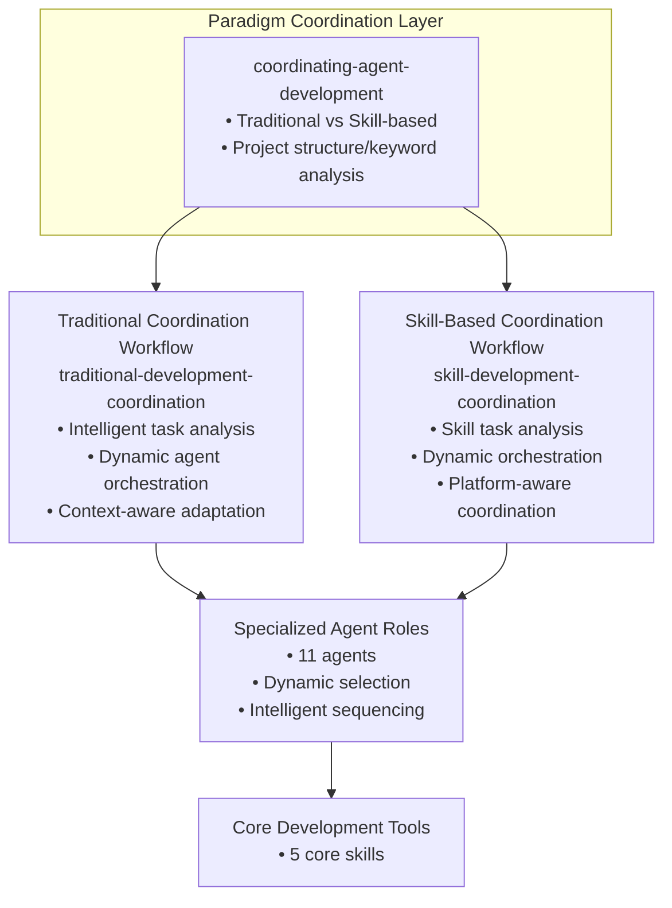

# AgentDev Suite

🌐 Language: **English** | [中文](../README.md)

📚 Documentation Navigation:
- [User Usage Guide](docs/en/usage-guide.md) - How to claim features, develop, and submit code
- [Agent Artifacts Directory Structure](docs/en/agent-artifacts.md) - Organizational structure of artifacts generated by each agent

A comprehensive multi-platform agent development suite for Claude Code, OpenCode, and Codex that provides intelligent agent collaboration across the full software development lifecycle.

## Overview

**AgentDev Suite** is a revolutionary agent-driven development framework that enables structured software development using specialized AI agents. It features a unique dual-paradigm coordination system that automatically routes development tasks to the appropriate workflow based on project context:

- **Traditional Software Development**: Executable code, APIs, services, libraries
- **Skill-Based Development**: AI skills, guidance packages, plugin projects

### Key Innovations

- **Paradigm-Based Routing**: Automatically detects project type and routes to specialized coordination
- **Multi-Platform Support**: Unified skill library for Claude Code, OpenCode, and Codex
- **Progressive Disclosure**: Efficient context management through three-level loading system
- **Agent Role Specialization**: 11 specialized agent roles for different development phases
- **Structured Collaboration**: Directory-based workspace for multi-agent coordination

## Installation

**Note:** Installation differs by platform and user type (AI assistant vs human).

### For AI Assistants

AI assistants can directly fetch installation instructions:

#### Codex
Tell Codex:
```
Fetch and follow instructions from https://raw.githubusercontent.com/gongxh13/agentdev-suite/refs/heads/main/.codex/INSTALL.md
```

#### OpenCode
Tell OpenCode:
```
Fetch and follow instructions from https://raw.githubusercontent.com/gongxh13/agentdev-suite/refs/heads/main/.opencode/INSTALL.md
```

#### Claude Code
Tell Claude Code:
```
Fetch and follow instructions from https://raw.githubusercontent.com/gongxh13/agentdev-suite/refs/heads/main/.claude-plugin/INSTALL.md
```

### For Human Users

#### Remote Installation (from Git repository)
Currently only Claude Code supports remote installation from Git repositories:

##### Claude Code

**Command Line:**
```bash
# Add Git repository as a marketplace
claude plugin marketplace add https://github.com/gongxh13/agentdev-suite.git
# Install the plugin from the added marketplace
claude plugin install agentdev-suite
```

**In Claude Code (slash commands):**
First, register the marketplace from the Git repository:
```
/plugin marketplace add https://github.com/gongxh13/agentdev-suite.git
```

Then install the plugin from this marketplace. Check the marketplace name with `/plugin marketplace list`:
```
/plugin install agentdev-suite@agentdev-suite-dev
```

*Example (if marketplace is named "agentdev-suite-dev"):*
```
/plugin install agentdev-suite@agentdev-suite-dev
```

#### Source Code Installation
Install from local source code:

##### Claude Code

**Command Line:**
```bash
# Add local directory as a marketplace
claude plugin marketplace add ./
# Install the plugin from the local marketplace
claude plugin install agentdev-suite
```

**In Claude Code (slash commands):**
First, register the local directory as a marketplace (with a name):
```
/plugin marketplace add ./ --name agentdev-suite-dev
```

Then install the plugin from this marketplace:
```
/plugin install agentdev-suite@agentdev-suite-dev
```

*If you don't specify a name, check the marketplace name with `/plugin marketplace list` and use `@<marketplace-name>` suffix.*

##### Codex
```bash
cp -r . ~/.codex/agentdev-suite
# Update ~/.codex/AGENTS.md with:
# ## agentdev-suite
# <EXTREMELY_IMPORTANT>
# You have access to agentdev-suite. RIGHT NOW run: ~/.codex/agentdev-suite/.codex/agentdev-suite-codex bootstrap
# </EXTREMELY_IMPORTANT>
```

##### OpenCode
```bash
git clone https://github.com/gongxh13/agentdev-suite.git ~/.config/opencode/agentdev-suite
mkdir -p ~/.config/opencode/plugins
ln -s ~/.config/opencode/agentdev-suite/.opencode/plugins/agentdev-suite.js ~/.config/opencode/plugins/agentdev-suite.js
mkdir -p ~/.config/opencode/skills
ln -s ~/.config/opencode/agentdev-suite/skills ~/.config/opencode/skills/agentdev-suite
```

## Architecture

AgentDev Suite follows an **enhanced three-layer coordination architecture** with intelligent task analysis and dynamic agent orchestration:



### Detailed Agent List

| Category | Agent Name | Role Abbreviation | Primary Responsibilities |
|----------|------------|-------------------|--------------------------|
| **Traditional Development Agents** | `traditional-pm` | pm | Product strategy and high-level requirements analysis |
| | `traditional-po` | po | Backlog management and user story decomposition |
| | `traditional-arch` | arch | System architecture and technical design |
| | `traditional-dev` | dev | Code implementation and unit testing |
| | `traditional-qa` | qa | Quality verification and bug reporting |
| | `traditional-ops` | ops | Build systems, deployment pipelines, and infrastructure configuration |
| **Skill Development Agents** | `skill-ra` | analyst | Skill ecosystem strategy and requirements analysis |
| | `skill-arch` | arch | Skill architecture and multi-platform configuration design |
| | `skill-dev` | dev | Skill project implementation and platform configuration |
| | `skill-qa` | qa | Skill structure validation and platform compatibility testing |
| | `skill-platform` | platform | Multi-platform skill distribution and deployment configuration |

### Core Development Tools

| Tool Name | Primary Function |
|-----------|------------------|
| `skill-creator` | Guided skill creation following Claude's best practices |
| `skill-project-scaffolder` | Multi-platform project structure generation |
| `skill-development-methodology` | Skill design principles and patterns |
| `traditional-development-methodology` | Traditional development best practices |
| `managing-git-workflows` | Version control with semantic commit guidelines |

### 1. Paradigm Coordination Layer

**`coordinating-agent-development`** - The intelligent first-level router that performs paradigm distinction:
- **Project Structure Indicators**: `src/`, `tests/`, `package.json` (Traditional) vs `skills/`, `.claude-plugin/`, SKILL.md files (Skill-based)
- **Request Keywords**: "build an app", "create API" (Traditional) vs "create skill", "skill project" (Skill-based)
- **Decision Rules**: Clear indicators → corresponding coordination; Mixed → analyze primary focus; None → ask user
- **Architecture Role**: Provides efficient first-level routing, delegating detailed task analysis to specialized coordination layers

### 2. Specialized Coordination Workflows with Intelligent Orchestration

#### Traditional Software Development (`traditional-development-coordination`)
**Enhanced with intelligent task analysis and dynamic agent orchestration**:
- **Task Type Detection**: Analyzes requests to identify specific task types (complete project, architecture design, requirements analysis, code implementation, testing, maintenance, documentation)
- **Dynamic Agent Selection**: Selects optimal agent sequence based on task type
- **Smart Workflow Adaptation**: Chooses between full 6-phase workflow or targeted agent combinations
- **Context-Aware Execution**: Adjusts workflow intensity based on project maturity and existing structure

**Workflow Patterns**:
- **Complete Project**: Full 6-phase workflow with all agents
- **Architecture Focus**: Architect → (Developer for prototyping)
- **Requirements Focus**: Product Manager → Product Owner
- **Implementation Focus**: Developer → Tester
- **Testing Focus**: Tester → (Developer for fixes)
- **Maintenance Tasks**: Adaptive workflow with context analysis
- **Documentation Tasks**: Targeted documentation workflow

#### Skill-Based Development (`skill-development-coordination`)
**Enhanced with intelligent skill task analysis and dynamic orchestration**:
- **Skill Task Type Detection**: Identifies skill-specific task types (complete skill project, skill architecture, requirements analysis, individual skill creation, testing, maintenance, platform configuration)
- **Dynamic Agent/Skill Selection**: Selects optimal agent/skill sequence based on task type
- **Platform-Aware Coordination**: Handles multi-platform configurations intelligently
- **Progressive Disclosure Optimization**: Ensures efficient context management for skill projects

**Workflow Patterns**:
- **Complete Skill Project**: Full 6-phase workflow with all agents
- **Architecture Focus**: Skill Architect → Skill Project Scaffolder
- **Requirements Focus**: Skill Requirements Analyst
- **Skill Creation Focus**: Skill Creator → Skill Tester
- **Testing Focus**: Skill Tester → (Skill Creator for fixes)
- **Maintenance Tasks**: Adaptive workflow for skill updates
- **Platform Configuration**: Scaffolder → Architect for multi-platform setup

### 3. Specialized Agent Roles with Dynamic Orchestration

#### Traditional Development Agents (Dynamically Selected)
- **`traditional-pm`**: Product strategy and high-level requirements analysis
- **`traditional-po`**: Backlog management and user story decomposition
- **`traditional-arch`**: System architecture and technical design
- **`traditional-dev`**: Code implementation and unit testing
- **`traditional-qa`**: Quality verification and bug reporting
- **`traditional-ops`**: Build systems, deployment pipelines, and infrastructure configuration

#### Skill Development Agents (Dynamically Selected)
- **`skill-ra`**: Skill ecosystem strategy and requirements analysis
- **`skill-arch`**: Skill architecture and multi-platform configuration design
- **`skill-qa`**: Skill structure validation and platform compatibility testing
- **`skill-dev`**: Skill project implementation and platform configuration
- **`skill-platform`**: Multi-platform skill distribution and deployment configuration

#### Dynamic Orchestration Capabilities
- **Intelligent Agent Selection**: Coordination layers analyze task types and select appropriate agents
- **Optimal Sequencing**: Agents are sequenced for maximum efficiency based on task requirements
- **Context-Aware Adaptation**: Agent instructions are tailored to project maturity and existing context
- **Feedback Loop Integration**: Agents work collaboratively with built-in quality assurance cycles
- **Minimal Overhead**: Simple tasks bypass unnecessary agents, complex projects get full coverage

### 4. Core Development Tools

- **`skill-creator`**: Guided skill creation following Claude's best practices
- **`skill-project-scaffolder`**: Multi-platform project structure generation
- **`skill-development-methodology`**: Skill design principles and patterns
- **`traditional-development-methodology`**: Traditional development best practices
- **`managing-git-workflows`**: Version control with semantic commit guidelines

### 5. Agent and Skill Collaboration

The core strength of AgentDev Suite lies in seamless collaboration between agents and skills:

- **Agent Role Specialization**: 11 specialized agents each handle specific responsibilities across the full development lifecycle from product strategy to testing
- **Skills as Tool Library**: Core development skills (like skill-creator, skill-project-scaffolder) provide standardized tools and methodologies for agents
- **Dynamic Orchestration Collaboration**: Coordination layers intelligently select agent sequences based on task types and invoke appropriate skills for support
- **Feedback Loop Optimization**: Agents execute tasks using skills, while skills continuously improve based on usage feedback, creating a positive reinforcement cycle
- **Cross-Platform Consistency**: All agents and skills maintain uniform behavior across multiple platforms (Claude Code, OpenCode, Codex)

This collaboration model ensures the development process is both highly structured and flexibly adaptable to different project needs.

## Multi-Platform Support

AgentDev Suite supports three major AI development platforms with a unified skill library:

| Platform | Configuration | Installation Method |
|----------|---------------|---------------------|
| **Claude Code** | `.claude-plugin/` | Plugin system with marketplace |
| **OpenCode** | `.opencode/` | Plugin script with symlinks |
| **Codex** | `.codex/` | Bootstrap script integration |

All platforms share the same `skills/` directory, ensuring consistent behavior across environments.

## Contributing

We welcome contributions to AgentDev Suite! To contribute:

1. Fork the repository
2. Create a feature branch (`git checkout -b feature/amazing-feature`)
3. Make your changes
4. Add tests for new functionality
5. Ensure all tests pass (`npm test`)
6. Commit your changes (`git commit -m 'Add amazing feature'`)
7. Push to the branch (`git push origin feature/amazing-feature`)
8. Open a Pull Request

### Development Guidelines
- Follow existing patterns and directory structure
- Maintain multi-platform compatibility
- Implement progressive disclosure for new skills
- Add comprehensive tests for new functionality
- Update documentation accordingly

## Multilingual Support

- **English**: This document (docs/en/README.md)
- **中文 (Chinese)**: [Root README](../README.md)

## License

MIT License - see [LICENSE](LICENSE) file for details.

## Acknowledgments

- Inspired by Claude's official [Skill Authoring Best Practices](https://platform.claude.com/docs/en/agents-and-tools/agent-skills/best-practices)
- Built with multi-platform compatibility as a core design principle
- Developed through iterative refinement with real-world usage feedback

---

**AgentDev Suite** - Revolutionizing AI-assisted software development through intelligent agent coordination and structured workflows.