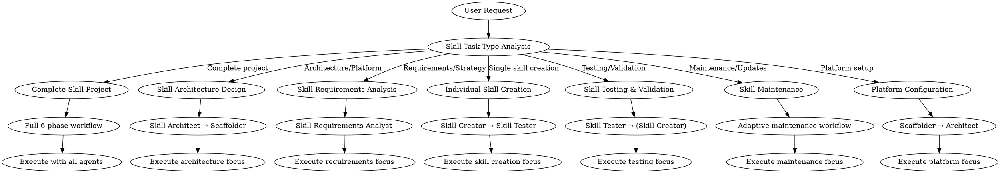
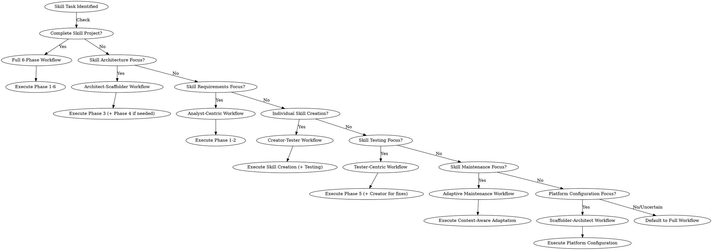

# Skill-Based Development Coordination

## Overview

This skill coordinates development workflows for skill-based projects that extend AI capabilities through modular, self-contained skill packages. It provides **intelligent workflow coordination** with dynamic agent selection based on task type analysis. The system automatically identifies the optimal agent combination and workflow sequence for each specific skill development request.

## Task Type Analysis & Dynamic Agent Orchestration

Before starting any coordination, analyze the task type to determine the optimal workflow:

### Task Type Detection Matrix

| Task Type | Indicators | Recommended Agents/Skills | Workflow Pattern |
|-----------|------------|---------------------------|------------------|
| **Complete Skill Project** | "create skill project", "multi-platform skill library", "new skill ecosystem" | Skill Requirements Analyst → Skill Architect → Skill Project Scaffolder → Skill Creator → Skill Tester | Full 6-phase workflow |
| **Skill Architecture Design** | "design skill architecture", "platform configuration", "skill structure design" | Skill Architect → (Skill Project Scaffolder for setup) | Phase 3 + optional Phase 4 |
| **Skill Requirements Analysis** | "analyze skill requirements", "define skill ecosystem", "skill strategy planning" | Skill Requirements Analyst | Phase 1-2 only |
| **Individual Skill Creation** | "create a skill", "write SKILL.md", "develop skill guidance" | Skill Creator → Skill Tester | Direct skill creation workflow |
| **Skill Testing & Validation** | "test skill", "verify platform compatibility", "validate skill structure" | Skill Tester → (Skill Creator for fixes) | Direct Phase 5 testing |
| **Skill Maintenance** | "update skill", "refactor skill", "improve skill documentation" | Skill Creator (with context analysis) → Skill Tester | Adaptive maintenance workflow |
| **Platform Configuration** | "configure multi-platform", "setup .claude-plugin/", "platform integration" | Skill Project Scaffolder → Skill Architect | Platform-focused workflow |

### Dynamic Orchestration Logic

1. **Analyze Request**: Parse user request for skill task type indicators
2. **Assess Context**: Check existing skill project structure, platform configurations, and documentation
3. **Select Workflow**: Choose optimal agent/skill sequence based on task type
4. **Adapt Intensity**: Adjust workflow depth based on task complexity and project maturity
5. **Execute Coordination**: Route to appropriate agents/skills with tailored instructions

### Orchestration Decision Flow



## When to Use

Use this skill when:
- Developing new skill projects or skill libraries with intelligent adaptation
- Creating individual skills with targeted agent coordination
- Extending existing skill ecosystems with context-aware workflows
- Configuring multi-platform skill distributions with optimal agent selection
- Testing and deploying skill packages based on specific validation needs
- Managing skill dependencies and relationships with dynamic orchestration

## Project Context Assessment

Before starting any skill development task, assess the project context:

### New Skill Project (Full Workflow)
Use when starting a complete skill project from scratch:
- No existing skill structure or minimal setup
- Requires multi-platform configuration
- Needs complete skill ecosystem design

### Existing Skill Project (Adaptive Workflow)
Use when working with established skill projects:
- Existing `skills/` directory present
- `.claude-plugin/`, `.codex/`, or `.opencode/` configurations exist
- Adding new skills or modifying existing ones

### Individual Skill Creation
Use when creating a single skill within an existing project:
- Focus on specific skill implementation
- Integration with existing skill library
- Testing and packaging individual skills

## Core Principles

1. **Progressive Disclosure**: Design skills with three-level loading (metadata → SKILL.md → resources)
2. **Context Efficiency**: Minimize token usage, avoid obvious information
3. **Platform Compatibility**: Support multiple AI platforms (Claude Code, Codex, OpenCode)
4. **Skill Relationships**: Manage dependencies and combinations between skills
5. **Quality Validation**: Verify skill structure, metadata, and functionality

## Workspace Structure

Skill projects use a standardized directory structure:

```
skill-project/
├── .claude-plugin/          # Claude Code configuration
├── .codex/                 # Codex platform configuration
├── .opencode/             # OpenCode platform configuration
├── skills/                # Skill library
│   ├── using-project/     # Entry point skill
│   ├── skill-creator/     # Skill creation guidance
│   ├── skill-project-scaffolder/ # Project scaffolding
│   └── [domain-skills]/   # Domain-specific skills
├── lib/                   # Shared utilities
├── templates/             # Project templates
└── tests/                # Test suites
```

Individual skill structure:
```
skill-name/
├── SKILL.md              # Required: YAML frontmatter + instructions
├── scripts/              # Optional: Executable code
├── references/           # Optional: Detailed documentation
└── assets/              # Optional: Output templates and resources
```

## Intelligent Skill Workflow Selection & Execution

Based on the skill task type analysis, select and execute the optimal workflow:

### Workflow Selection Logic



### Dynamic Agent/Skill Orchestration Examples

#### Example 1: Complete Skill Project
**Request**: "Create a multi-platform skill project for financial analysis workflows"
**Analysis**: Complete skill project indicators detected
**Workflow**: Full 6-phase workflow
**Agent Sequence**:
1. `skill-requirements-analyst` → Skill ecosystem strategy in `docs/01_product_strategy/`
2. `skill-requirements-analyst` → Skill specifications in `docs/02_product_backlog/`
3. `skill-architect` → Architecture and platform design in `docs/03_system_design/`
4. `skill-project-scaffolder` → Multi-platform project structure
5. `skill-creator` → Individual skill development
6. `skill-tester` → Platform compatibility testing
7. `managing-git-workflows` → Final packaging and distribution

#### Example 2: Skill Architecture Design
**Request**: "Design the architecture for our new skill library supporting Claude Code and OpenCode"
**Analysis**: Skill architecture design indicators detected
**Workflow**: Architect-scaffolder workflow
**Agent Sequence**:
1. `skill-architect` → Skill architecture design in `docs/03_system_design/`
2. `skill-project-scaffolder` → Platform configuration setup

#### Example 3: Individual Skill Creation
**Request**: "Create a skill for API documentation generation"
**Analysis**: Individual skill creation indicators detected
**Workflow**: Creator-tester workflow
**Agent/Skill Sequence**:
1. `skill-creator` → Guided skill development following best practices
2. `skill-tester` → Skill validation and platform testing

#### Example 4: Platform Configuration
**Request**: "Configure multi-platform support for our existing skill project"
**Analysis**: Platform configuration indicators detected
**Workflow**: Scaffolder-architect workflow
**Agent Sequence**:
1. `skill-project-scaffolder` → Platform configuration setup
2. `skill-architect` → Architecture review and integration

### Phase Reference for Dynamic Orchestration

When orchestrating agents/skills dynamically, use these phase definitions as building blocks:

#### Phase 1: Project Strategy & Scope (Skill Requirements Analyst)
- **Agent**: `skill-requirements-analyst`
- **Action**: Analyze requirements for skill project strategy
- **Context**: User request for skill development
- **Instruction**: "Analyze this skill development request. Create or update project strategy documents in `docs/01_product_strategy/`. Focus on skill ecosystem design, target platforms, and user scenarios."
- **Output**: `docs/01_product_strategy/skill_prd.md`, `platform_analysis.md`, `skill_roadmap.md`

#### Phase 2: Skill Requirements & Design (Skill Requirements Analyst)
- **Agent**: `skill-requirements-analyst` (continued)
- **Action**: Define skill specifications and design principles
- **Context**: Read `docs/01_product_strategy/`
- **Instruction**: "Read the strategy docs. Create or update skill specifications in `docs/02_product_backlog/`. Define skill relationships, progressive disclosure strategy, and platform requirements."
- **Output**: `docs/02_product_backlog/skill_specs.md`, `skill_relationships.md`, `platform_configs.md`

#### Phase 3: Skill Architecture & Platform Design (Skill Architect)
- **Agent**: `skill-architect`
- **Action**: Design skill architecture and platform configurations
- **Context**: Read `docs/01_product_strategy/` and `docs/02_product_backlog/`
- **Instruction**: "Design skill project architecture. Create or update technical design documents in `docs/03_system_design/`. Include multi-platform configuration strategy, skill structure patterns, and testing approach."
- **Output**: `docs/03_system_design/skill_architecture.md`, `platform_configuration.md`, `testing_strategy.md`

#### Phase 4: Iterative Skill Development (Skill Creator & Scaffolder)
- **Skills**: `skill-creator` (individual skills), `skill-project-scaffolder` (project structure)
- **Strategy**: Adaptive iteration based on project scope and task type
- **Action**: Plan → Develop → Verify → Test with platform compatibility

#### Phase 5: Integration & Platform Testing (Skill Tester)
- **Agent**: `skill-tester`
- **Action**: Test complete skill ecosystem across target platforms
- **Instruction**: "Run comprehensive platform compatibility tests. Verify skill loading, progressive disclosure, and cross-platform consistency."
- **Output**: Integration test report in `docs/05_qa_reports/`

#### Phase 6: Packaging & Distribution (Managing Git Workflows)
- **Skill**: `managing-git-workflows`
- **Condition**: Only proceed if integration testing is successful
- **Action**: Package skills, update configurations, and prepare for distribution

### Smart Context Adaptation for Skill Projects

When executing skill workflows, apply these adaptation rules:

1. **Existing Skill Project**: Reference existing skill library, follow established patterns
2. **New Skill Ecosystem**: Complete design from scratch with multi-platform consideration
3. **Individual Skill Context**: Focus on skill-specific implementation, integrate with existing structure
4. **Platform Migration**: Handle platform-specific adaptations while preserving skill functionality
5. **Skill Updates**: Maintain backward compatibility, update documentation incrementally
6. **Testing Focus**: Validate platform compatibility, progressive disclosure, and skill loading

### Orchestration Checklist for Skill Development

Copy this checklist when orchestrating skill development tasks:

```
Skill Task Analysis & Orchestration:
- [ ] Identify skill task type from request indicators
- [ ] Assess existing skill project context and platform configurations
- [ ] Select optimal workflow pattern based on task type
- [ ] Determine agent/skill sequence with appropriate adaptation
- [ ] Apply skill-specific context adaptation rules
- [ ] Execute dynamic agent/skill coordination
- [ ] Monitor progress and adjust workflow as needed
```

## Skill Development Best Practices

### Skill Design
- **Clear triggers**: Description must start with "Use when" and specify exact conditions
- **Appropriate freedom**: Match instruction specificity to task fragility
- **Resource organization**: Separate SKILL.md, references, scripts, assets
- **Progressive disclosure**: Keep SKILL.md concise, move details to references

### Platform Compatibility
- **Multi-platform support**: Configure `.claude-plugin/`, `.codex/`, `.opencode/`
- **Shared skill library**: All platforms use same `skills/` directory
- **Platform-specific adaptations**: Handle through installation scripts
- **Testing**: Verify functionality across all target platforms

### Quality Assurance
- **Structure validation**: Check required files and directory structure
- **Metadata validation**: Ensure proper frontmatter format
- **Content quality**: Verify clarity, completeness, and accuracy
- **Platform testing**: Test installation and functionality on each platform

## Key Differences from Traditional Development

### Deliverables
- **Skill projects**: AI guidance packages (skills) with SKILL.md files
- **Traditional projects**: Executable code with source files

### Focus Areas
- **Skill projects**: Knowledge transfer, process guidance, AI assistance
- **Traditional projects**: Functionality, performance, reliability

### Testing Approach
- **Skill projects**: Validate guidance quality, structure, platform compatibility
- **Traditional projects**: Verify code execution, functionality, performance

### Deployment
- **Skill projects**: Plugin systems, skill libraries, platform configurations
- **Traditional projects**: Servers, containers, devices, package managers

## Available Specialized Skills

This coordination leverages these specialized skills designed specifically for skill development:

### Core Skill Development Skills
- `skill-creator`: Guided skill creation with best practices
- `skill-project-scaffolder`: Multi-platform project scaffolding
- `skill-development-methodology`: Skill development principles and patterns

### Skill-Specific Analysis & Design Skills
- `skill-requirements-analyst`: Skill requirements and ecosystem strategy analysis
- `skill-architect`: Skill architecture and platform configuration design
- `skill-tester`: Skill structure and platform compatibility testing

### Supporting Skills
- `managing-git-workflows`: Version control for skill projects
- `traditional-development-methodology`: Traditional development comparison (for reference)

## Common Use Cases

### New Skill Project Development
1. Analyze requirements and define skill ecosystem
2. Setup multi-platform project structure
3. Create core skills (entry point, creator, scaffolder)
4. Develop domain-specific skills
5. Test across platforms and package for distribution

### Individual Skill Creation
1. Define skill purpose and trigger conditions
2. Design progressive disclosure structure
3. Implement SKILL.md and bundled resources
4. Test skill functionality and integration
5. Package and integrate into existing project

### Skill Project Maintenance
1. Analyze existing skill library and configurations
2. Identify improvements or new skill needs
3. Implement changes with backward compatibility
4. Test platform compatibility
5. Update documentation and distribution

## Detection Logic for Skill Projects

This skill should be triggered when:
- User requests involve "skill development", "creating skills", "skill project"
- Existing project contains `skills/` directory
- Project has `.claude-plugin/`, `.codex/`, or `.opencode/` configurations
- Context involves AI guidance, knowledge packages, or plugin development

## Integration with Traditional Development

For hybrid projects containing both skills and traditional code:
1. Use `coordinating-agent-development` for overall coordination
2. Route to appropriate sub-coordination based on component type
3. Manage dependencies between skill and code components
4. Coordinate testing and deployment for both paradigms

## Troubleshooting

### Common Issues
- **Skill not triggering**: Check description starts with "Use when" and has clear conditions
- **Platform incompatibility**: Verify all platform configurations are properly set
- **Context bloat**: Review progressive disclosure design, move details to references
- **Packaging failures**: Validate skill structure meets packaging requirements

### Debugging Tips
- Check skill metadata (name and description) for triggering accuracy
- Verify platform-specific configuration files
- Review test reports in `docs/05_qa_reports/`
- Test skill loading and progressive disclosure behavior