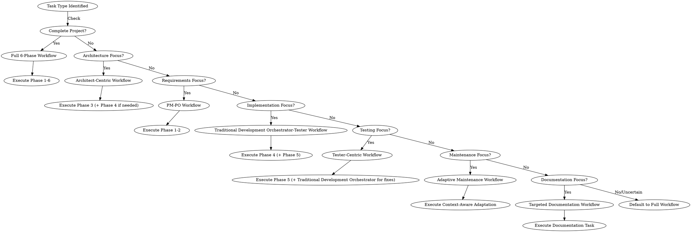

# Traditional Software Development Coordination

## Overview

This skill coordinates traditional software development lifecycle for executable software projects. It provides **intelligent workflow coordination** with dynamic agent selection based on task type analysis. The system automatically identifies the optimal agent combination and workflow sequence for each specific development request.

## Task Type Analysis & Dynamic Agent Orchestration

Before starting any coordination, analyze the task type to determine the optimal workflow:

### Task Type Detection Matrix

| Task Type | Indicators | Recommended Agents | Workflow Pattern |
|-----------|------------|-------------------|------------------|
| **Complete Project Development** | "build an app", "create API", "new project", "from scratch" | PM → PO → Architect → Traditional Development Orchestrator → Tester | Full 6-phase workflow |
| **Architecture Design** | "design system", "select technology", "architecture review", "choose stack" | Traditional Development Architect → (Traditional Development Orchestrator for prototyping) | Phase 3 + optional Phase 4 |
| **Requirement Analysis** | "analyze requirements", "define features", "product planning", "scope definition" | PM → PO | Phase 1-2 only |
| **Code Implementation** | "implement feature", "write code", "add functionality", "fix bug" | Traditional Development Orchestrator → Traditional Development Tester | Direct Phase 4 iteration |
| **Testing & Validation** | "test feature", "verify quality", "run tests", "validate requirements" | Traditional Development Tester → (Traditional Development Orchestrator for fixes) | Direct Phase 5 |
| **Maintenance Tasks** | "refactor code", "optimize performance", "update dependencies", "small changes" | Traditional Development Orchestrator (with context analysis) → Traditional Development Tester | Adaptive workflow |
| **Documentation Tasks** | "write documentation", "update API docs", "create technical specs" | Traditional Development Architect or Traditional Development Orchestrator (based on scope) | Targeted documentation |

### Dynamic Orchestration Logic

1. **Analyze Request**: Parse user request for task type indicators
2. **Assess Context**: Check project maturity, existing files, and documentation
3. **Select Workflow**: Choose optimal agent sequence based on task type
4. **Adapt Intensity**: Adjust workflow depth based on task complexity and project maturity
5. **Execute Coordination**: Route to appropriate agents with tailored instructions

### Orchestration Decision Flow

```dot
digraph orchestration_flow {
    "User Request" -> "Task Type Analysis";
    "Task Type Analysis" -> "Complete Project" [label="Complete development"];
    "Task Type Analysis" -> "Architecture Design" [label="Design/Architecture"];
    "Task Type Analysis" -> "Requirement Analysis" [label="Planning/Requirements"];
    "Task Type Analysis" -> "Code Implementation" [label="Implementation/Bug fix"];
    "Task Type Analysis" -> "Testing & Validation" [label="Testing/Verification"];
    "Task Type Analysis" -> "Maintenance Tasks" [label="Maintenance/Optimization"];
    "Task Type Analysis" -> "Documentation Tasks" [label="Documentation"];

    "Complete Project" -> "Full 6-phase workflow";
    "Architecture Design" -> "Traditional Development Architect → (Traditional Development Orchestrator)";
    "Requirement Analysis" -> "PM → PO";
    "Code Implementation" -> "Traditional Development Orchestrator → Traditional Development Tester";
    "Testing & Validation" -> "Traditional Development Tester → (Traditional Development Orchestrator)";
    "Maintenance Tasks" -> "Adaptive workflow";
    "Documentation Tasks" -> "Targeted documentation";

    "Full 6-phase workflow" -> "Execute with all agents";
    "Traditional Development Architect → (Traditional Development Orchestrator)" -> "Execute architecture focus";
    "PM → PO" -> "Execute requirements focus";
    "Traditional Development Orchestrator → Traditional Development Tester" -> "Execute implementation focus";
    "Traditional Development Tester → (Traditional Development Orchestrator)" -> "Execute testing focus";
    "Adaptive workflow" -> "Execute maintenance focus";
    "Targeted documentation" -> "Execute documentation focus";
}
```



## When to Use

Use this skill when:
- Developing new software features or projects end-to-end
- Maintaining and modifying existing codebases
- Coordinating multiple specialized agents based on task type
- Following structured development processes with intelligent adaptation
- Managing complex development tasks with dynamic workflow selection
- Fixing bugs or implementing small changes with appropriate agent focus

## Project Context Assessment

Before starting any development task, assess the project context:

### New Project Development (Full Workflow)
Use when starting from scratch or implementing major new features:
- No existing codebase or minimal structure
- Requires complete requirements analysis and architecture design
- Follow full 6-phase development workflow

### Existing Project Maintenance (Adaptive Workflow)
Use when working with established codebases:
- Existing `src/`, `tests/`, `package.json`, etc. present
- Making bug fixes, small features, or improvements
- Skip unnecessary phases based on project maturity:
  - **Mature project**: Start at Phase 4 (Iterative Development)
  - **Partial documentation**: Start at earliest missing phase
  - **Established patterns**: Follow existing conventions and architecture

### Decision Criteria
1. Check for existing files: `src/`, `tests/`, `package.json`, `docs/`
2. Evaluate project maturity and documentation completeness
3. Determine appropriate starting phase based on needs
4. Adapt workflow to match project context

## Core Principles

1. **Agent-First Development**: Leverage appropriate specialized agents for each development phase
2. **Lifecycle Coverage**: Complete coverage from requirements to deployment
3. **Collaborative Intelligence**: Multiple agents work together through standardized workspace
4. **Quality Assurance**: Automated validation and testing at every stage
5. **Iterative Development**: Manage complexity with incremental feature implementation

## Workspace Structure

We use a standardized directory structure for collaboration. Ensure agents save their outputs to these specific folders:

- **PM Workspace**: `docs/01_product_strategy/`
- **PO Workspace**: `docs/02_product_backlog/`
- **Architect Workspace**: `docs/03_system_design/`
- **Dev Workspace**: `src/` (Code), `tests/` (Tests), `docs/04_development/` (Tech Notes)
- **QA Workspace**: `docs/05_qa_reports/`

## Intelligent Workflow Selection & Execution

Based on the task type analysis, select and execute the optimal workflow:

### Workflow Selection Logic



### Dynamic Agent Orchestration Examples

#### Example 1: Complete Project Development
**Request**: "I need to build a REST API service for user management"
**Analysis**: Complete project indicators detected
**Workflow**: Full 6-phase workflow
**Agent Sequence**:
1. `product-manager` → PRD in `docs/01_product_strategy/`
2. `product-owner` → Backlog in `docs/02_product_backlog/`
3. `traditional-development-architect` → Architecture in `docs/03_system_design/`
4. `traditional-development-orchestrator` → Parallel implementation with technology patterns in `src/`
5. `traditional-development-tester` → Tests and validation
6. `managing-git-workflows` → Final delivery

#### Example 2: Architecture Design Only
**Request**: "Design the architecture for our new microservices system"
**Analysis**: Architecture design indicators detected
**Workflow**: Architect-centric workflow
**Agent Sequence**:
1. `traditional-development-architect` → Architecture design in `docs/03_system_design/`
2. (Optional) `traditional-development-orchestrator` → Prototype implementation if requested

#### Example 3: Bug Fix
**Request**: "Fix the authentication bug in the login module"
**Analysis**: Code implementation indicators detected
**Workflow**: Traditional Development Orchestrator-Tester workflow
**Agent Sequence**:
1. `traditional-development-tester` → Reproduce and analyze bug
2. `traditional-development-orchestrator` → Implement fix in `src/`
3. `traditional-development-tester` → Verify fix and run regression tests

#### Example 4: Requirement Analysis
**Request**: "Analyze requirements for the new payment integration feature"
**Analysis**: Requirement analysis indicators detected
**Workflow**: PM-PO workflow
**Agent Sequence**:
1. `product-manager` → High-level requirements in `docs/01_product_strategy/`
2. `product-owner` → User stories and backlog in `docs/02_product_backlog/`

### Phase Reference for Dynamic Orchestration

When orchestrating agents dynamically, use these phase definitions as building blocks:

#### Phase 1: Product Definition (Product Manager)
- **Agent**: `product-manager`
- **Action**: Analyze user request for product strategy
- **Context**: Pass the user's initial request
- **Instruction**: "Analyze this request. Create or update the Product Requirements Document (PRD) and other strategy docs in `docs/01_product_strategy/`. Ensure the directory exists."
- **Output**: `docs/01_product_strategy/prd.md`, `market_analysis.md`, `roadmap.md`

#### Phase 2: Requirement Decomposition (Product Owner)
- **Agent**: `product-owner`
- **Action**: Break down high-level requirements into user stories
- **Context**: Read `docs/01_product_strategy/`
- **Instruction**: "Read the strategy docs in `docs/01_product_strategy/`. Create or update the detailed Product Backlog and User Stories in `docs/02_product_backlog/`. Ensure the directory exists."
- **Output**: `docs/02_product_backlog/backlog.md`, `features/*.md`

#### Phase 3: Architecture Design (Software Architect)
- **Agent**: `traditional-development-architect`
- **Action**: Design system architecture based on requirements
- **Context**: Read `docs/01_product_strategy/` and `docs/02_product_backlog/`
- **Instruction**: "Read the PRD and Backlog. Create or update Technical Design documents in `docs/03_system_design/`. Ensure the directory exists."
- **Output**: `docs/03_system_design/architecture.md`, `api_spec.md`, `database_schema.md`

#### Phase 4: Iterative Development with Skill-First Parallel Execution (Traditional Development Orchestrator)
- **Agent**: `traditional-development-orchestrator`
- **Strategy**: Use skill-first approach prioritizing technology-specific skills over generic Task execution, with adaptive parallel execution capabilities
- **Action Flow**:
  1. Analyze technology stack and load relevant patterns
  2. Identify independent features for parallel development
  3. Prioritize using technology-specific skills (Skill()) for feature implementation
  4. Use Task execution only when no relevant skill exists (fallback approach)
  5. Manage dependencies and integration
  6. Coordinate testing and quality verification
- **Key Features**:
  - Skill-first development: Prioritize using available technology-specific skills
  - Parallel execution of independent features with appropriate execution method
  - Technology-specific pattern integration through skill guidance
  - Automated skill loading based on technology stack detection
  - Dependency-aware task scheduling with skill/Task selection

#### Phase 5: Final Integration & Acceptance
- **Agent**: `traditional-development-tester`
- **Action**: Run full regression test suite
- **Instruction**: "Run comprehensive regression testing to ensure no regressions were introduced."
- **Output**: Final test report in `docs/05_qa_reports/`

#### Phase 6: Delivery & Version Control
- **Agent**: `managing-git-workflows` skill
- **Condition**: Only proceed if Final Integration Testing is successful
- **Action**: Package and deliver final artifacts with semantic versioning

### Smart Context Adaptation

When executing workflows, apply these adaptation rules:

1. **Existing Project Context**: Skip unnecessary phases, reference existing patterns
2. **Partial Documentation**: Start at earliest missing phase, fill gaps incrementally
3. **Mature Codebase**: Focus on code changes, minimal documentation overhead
4. **Maintenance Tasks**: Target specific changes, preserve existing functionality
5. **Hybrid Requests**: Combine relevant phases from different workflows

### Orchestration Checklist

Copy this checklist when orchestrating development tasks:

```
Task Analysis & Orchestration:
- [ ] Identify task type from request indicators
- [ ] Assess project context and maturity
- [ ] Select optimal workflow pattern
- [ ] Determine agent sequence
- [ ] Apply context adaptation rules
- [ ] Execute dynamic agent coordination
- [ ] Monitor progress and adjust as needed
```

## Handling Feedback Loops (Bugs)

- **Monitor**: Check the latest report in `docs/05_qa_reports/`
- **If Bugs Found**:
  1. Call developer to fix identified bugs
  2. **Instruction**: "Read the latest report in `docs/05_qa_reports/` and fix identified bugs in `src/`."
  3. After fixes, call tester again for verification
- **Success**: When tests pass, proceed to next step

## Data Passing Strategy

- **Directory-Based**: Agents read from upstream directories and write to their own dedicated workspace directories
- **Persistence**: Check for existing files and update/append when continuing ongoing tasks
- **Consistency**: Maintain standardized directory structure across all agents

## Best Practices

### For Requirement Analysis
- Always extract acceptance criteria for each requirement
- Validate requirements against existing system constraints
- Prioritize using MoSCoW method (Must have, Should have, Could have, Won't have)

### For Code Implementation
- Follow existing project patterns and conventions
- Include appropriate error handling and logging
- Generate corresponding test files
- Document public APIs and interfaces

### For Testing
- Aim for comprehensive test coverage
- Include unit, integration, and end-to-end tests
- Test edge cases and error conditions
- Validate performance requirements

### For Collaboration
- Maintain shared context through directory-based workspace
- Use standardized communication formats
- Document agent decisions and rationale
- Implement feedback loops for quality-critical tasks

## Checklist for Project Coordination

Copy this checklist when coordinating a software development project:

```
Software Development Progress:
- [ ] Phase 1: Product Definition (Product Manager)
- [ ] Phase 2: Requirement Decomposition (Product Owner)
- [ ] Phase 3: Architecture Design (Software Architect)
- [ ] Phase 4: Iterative Development:
  - [ ] Feature 1: Development & Testing
  - [ ] Feature 2: Development & Testing
  - [ ] Feature 3: Development & Testing
- [ ] Phase 5: Final Integration Testing
- [ ] Phase 6: Delivery & Version Control
```

## Available Specialized Skills

This suite coordinates these specialized skills:

### Core Development Agents
- `product-manager`: Product strategy and high-level requirements
- `product-owner`: Backlog management and user stories
- `traditional-development-architect`: System architecture design
- `traditional-development-orchestrator`: Code implementation with skill-first approach and parallel execution
- `traditional-development-tester`: Testing and quality verification
- `managing-git-workflows`: Git operations and commit guidelines

### Technology-Specific Pattern Skills
- `nodejs-backend-patterns`: Node.js/Express/Next.js backend architecture patterns
- `react-frontend-patterns`: React/Next.js frontend development patterns
- `django-patterns`: Django framework best practices
- `springboot-patterns`: Spring Boot architecture patterns
- `python-patterns`: Pythonic idioms and PEP 8 standards
- `golang-patterns`: Go language best practices
- `java-coding-standards`: Java coding standards for Spring Boot
- `java-jpa-patterns`: JPA/Hibernate data access patterns

### Development Standards & Security
- `typescript-coding-standards`: TypeScript/JavaScript coding standards
- `security-review`: Security checklist and vulnerability prevention

## Common Use Cases

### New Feature Development
1. Analyze requirements with Product Manager
2. Decompose into user stories with Product Owner
3. Design architecture with Traditional Development Architect
4. Implement features with parallel execution using Traditional Development Orchestrator
5. Verify with Tester
6. Final integration and delivery

### Bug Fix Workflow
1. Reproduce and analyze bug
2. Identify root cause
3. Generate fix with Traditional Development Orchestrator
4. Test fix with Tester
5. Validate no regressions introduced

### Refactoring Process
1. Analyze code quality
2. Design refactoring strategy
3. Execute refactoring
4. Validate with tests
5. Ensure backward compatibility

## Configuration

Agents can be configured through:
- Directory-based workspace structure
- Standardized file formats and templates
- Project-specific conventions in `docs/` directories

## Troubleshooting

### Common Issues
- **Agent coordination failures**: Check directory structure and file permissions
- **Missing context**: Verify upstream directories contain required documents
- **Workspace issues**: Ensure directories exist with `mkdir -p` before writing

### Debugging Tips
- Check agent outputs in respective workspace directories
- Verify file formats and naming conventions
- Review test reports in `docs/05_qa_reports/`

## Integration

AgentDev Suite integrates with:
- Version control systems through `managing-git-workflows` skill
- CI/CD pipelines through standardized test outputs
- Project management through structured documentation