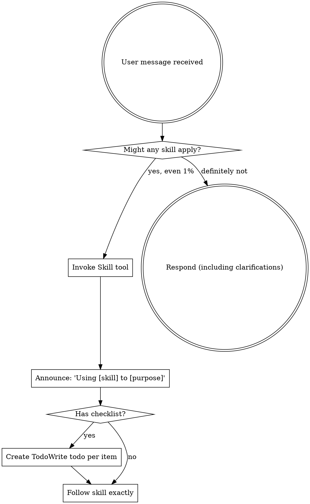

<EXTREMELY-IMPORTANT>
If you think there is even a 1% chance a skill might apply to what you are doing, you ABSOLUTELY MUST invoke the skill.

IF A SKILL APPLIES TO YOUR TASK, YOU DO NOT HAVE A CHOICE. YOU MUST USE IT.

This is not negotiable. This is not optional. You cannot rationalize your way out of this.
</EXTREMELY-IMPORTANT>

## How to Access Skills

**In Claude Code:** Use the `Skill` tool. When you invoke a skill, its content is loaded and presented to you—follow it directly. Never use the Read tool on skill files.

**In other environments:** Check your platform's documentation for how skills are loaded.

# Using Skills

## The Rule

**Invoke relevant or requested skills BEFORE any response or action.** Even a 1% chance a skill might apply means that you should invoke the skill to check. If an invoked skill turns out to be wrong for the situation, you don't need to use it.



## Red Flags

These thoughts mean STOP—you're rationalizing:

| Thought | Reality |
|---------|---------|
| "This is just a simple question" | Questions are tasks. Check for skills. |
| "I need more context first" | Skill check comes BEFORE clarifying questions. |
| "Let me explore the codebase first" | Skills tell you HOW to explore. Check first. |
| "I can check git/files quickly" | Files lack conversation context. Check for skills. |
| "Let me gather information first" | Skills tell you HOW to gather information. |
| "This doesn't need a formal skill" | If a skill exists, use it. |
| "I remember this skill" | Skills evolve. Read current version. |
| "This doesn't count as a task" | Action = task. Check for skills. |
| "The skill is overkill" | Simple things become complex. Use it. |
| "I'll just do this one thing first" | Check BEFORE doing anything. |
| "This feels productive" | Undisciplined action wastes time. Skills prevent this. |
| "I know what that means" | Knowing the concept ≠ using the skill. Invoke it. |

## Skill Priority

When multiple skills could apply, use this order:

1. **Process skills first** (brainstorming, debugging) - these determine HOW to approach the task
2. **Implementation skills second** (frontend-design, mcp-builder) - these guide execution

"Let's build X" → brainstorming first, then implementation skills.
"Fix this bug" → debugging first, then domain-specific skills.

## Skill Types

**Rigid** (TDD, debugging): Follow exactly. Don't adapt away discipline.

**Flexible** (patterns): Adapt principles to context.

The skill itself tells you which.

## User Instructions

Instructions say WHAT, not HOW. "Add X" or "Fix Y" doesn't mean skip workflows.

## Customization Notes for agentdev-suite

**AUTO-GENERATED TEMPLATE - REVIEW AND CUSTOMIZE FOR YOUR SPECIFIC PROJECT**

This skill provides the core discipline framework for your project. You **must** customize it to make it effective for agentdev-suite.

### Why Customize?
The generic template ensures skill discipline, but project-specific context makes it actionable. Without customization, users won't know:
- What agentdev-suite actually does
- Which skills are most important for your workflows
- How to apply skills to your specific tasks

### How to Customize
Replace all instances of `agentdev-suite` with your actual project name throughout this file. Then enhance these sections:

1. **Project-specific context**: Explain what agentdev-suite is and its scope
   ```markdown
   ## Project Context
   agentdev-suite is a [describe purpose: e.g., "collection of skills for AI-assisted web development"]. It focuses on [key areas: e.g., "React components, API design, testing"].

   **Scope**: [What's included/excluded]
   **Users**: [Who uses these skills]
   **Goals**: [Primary objectives]
   ```

2. **Key workflows**: Describe the most important agentdev-suite workflows that skills enforce
   ```markdown
   ## Key Workflows
   - **Feature Development**: Brainstorming → TDD → Implementation → Review
   - **Bug Fixing**: Systematic debugging → Root cause analysis → Fix → Verification
   - **Code Review**: Security review → Code quality review → Performance review
   ```

3. **Skill categories**: List the main skill categories in agentdev-suite and their purposes
   ```markdown
   ## Skill Categories
   - **Process Skills** (brainstorming, debugging, planning): Determine HOW to approach tasks
   - **Implementation Skills** (frontend-design, mcp-builder): Guide execution of specific tasks
   - **Quality Skills** (testing, security-review, code-review): Ensure quality and security
   ```

4. **Platform-specific guidance**: Add details about how agentdev-suite skills work on different platforms
   ```markdown
   ## Platform Support
   - **Claude Code**: Skills loaded via `Skill: agentdev-suite/using-agentdev-suite`
   - **OpenCode**: Skills available via native skill tool
   - **Codex**: Use `~/.codex/agentdev-suite/.codex/agentdev-suite-codex use-skill`
   ```

5. **Common use cases**: Provide examples of typical agentdev-suite tasks and which skills apply
   ```markdown
   ## Common Use Cases
   - "Add a new React component" → brainstorming → frontend-design → tdd
   - "Fix API authentication bug" → systematic-debugging → security-review
   - "Optimize database query" → planning → database-reviewer
   ```

### Customization Checklist
- [ ] Replace all `agentdev-suite` references with your actual project name
- [ ] Add project context section after "User Instructions"
- [ ] Enhance key workflows with your actual development processes
- [ ] List your actual skill categories and purposes
- [ ] Add platform-specific details relevant to your users
- [ ] Provide real use cases from your project
- [ ] Test the customized skill by invoking it in a conversation

### Quick Start Example
For a quick customization, replace this entire "Customization Notes" section with:

```markdown
## Project Context
agentdev-suite is a skill library for [your purpose]. It helps with [primary activities].

## Key Workflows
1. [Your workflow 1]
2. [Your workflow 2]

## Skill Categories
- **Category 1**: [Description]
- **Category 2**: [Description]

## Platform Notes
[Your platform specifics]

## Common Tasks
- "[Task description]" → [skill1] → [skill2]
```

Remember: The goal of using-agentdev-suite is to establish mandatory skill discipline for **your specific project** conversations. Generic templates are ignored; customized skills are followed.

## Project Context for AgentDev Suite

AgentDev Suite is a comprehensive agent development suite for Claude Code that covers the full software development lifecycle with intelligent agent collaboration. It integrates requirement analysis, development, testing, and deployment into a cohesive agent-driven workflow.

**Scope**: Full software development lifecycle management with specialized agent roles
**Users**: Software development teams using AI-assisted development workflows
**Goals**: Streamline AI-assisted software development with structured processes and quality assurance

## Key Workflows

1. **Complete Software Development**: Product Definition → Requirement Decomposition → Architecture Design → Iterative Development → Final Integration → Delivery
2. **Agent Role Coordination**: Product Manager, Product Owner, Architect, Developer, Tester role coordination
3. **Structured Development**: 6-phase development process from requirements to delivery
4. **Quality Assurance**: Automated validation and testing at every stage

## Skill Categories

- **Process Coordination Skills** (coordinating-agent-development, managing-git-workflows): Coordinate agent roles and development workflows
- **Requirements & Strategy Skills** (defining-product-strategy, decomposing-requirements): Define product vision and break down requirements
- **Architecture & Implementation Skills** (designing-system-architecture, implementing-software-features): Design systems and implement features
- **Quality Assurance Skills** (testing-software-quality): Ensure software quality through testing
- **Project Management Skills** (skill-project-scaffolder): Create and manage multi-platform skill project structures (entire projects with platform configurations)
- **Skill Development Skills** (skill-creator): Create individual skills following Claude's best practices (creates SKILL.md and associated resources within a skills/ directory)

## Platform Support

- **Claude Code**: Skills loaded via `Skill: agentdev-suite/using-agentdev-suite`
- **OpenCode**: Skills available via native skill tool after installation
- **Codex**: Use `~/.codex/agentdev-suite/.codex/agentdev-suite-codex use-skill`

## Common Use Cases

- "I need to develop a REST API service with user management" → defining-product-strategy → decomposing-requirements → designing-system-architecture → implementing-software-features → testing-software-quality
- "Help me coordinate a development team for a new feature" → coordinating-agent-development → managing-git-workflows
- "Create a multi-platform skill project" → skill-project-scaffolder
- "Create a new skill following best practices" → skill-creator
- "Fix a bug in the authentication module" → testing-software-quality → implementing-software-features
